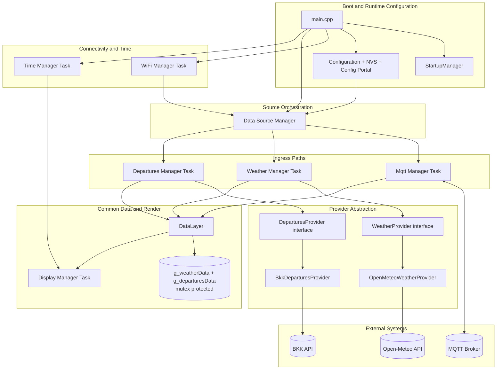
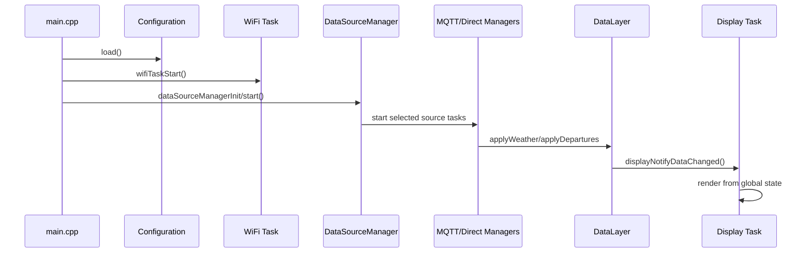

# ESP32 BKK E-Ink Departures Board

ESP32 firmware for a 7.3 inch color e-paper board that shows:
- public transport departures over MQTT
- weather forecast over MQTT
- connection/status information
- on-device configuration portal (AP mode)

The project is built with PlatformIO and runs on Seeed XIAO ESP32S3.

## What This Project Does

The board acts as an always-on information display:
- connects to Wi-Fi
- subscribes to MQTT topics for departures and weather
- stores and compares incoming payloads
- refreshes the display only when needed (plus periodic policy in display task)
- supports a boot-time config mode with captive portal for editing settings

It is designed for low-noise updates on e-paper and for robust operation with reconnecting Wi-Fi/MQTT tasks.

## Hardware and Stack

- MCU: Seeed XIAO ESP32S3
- Display: 7.3 inch Seeed e-paper board (EE04 combo config)
- Framework: Arduino (on ESP-IDF/FreeRTOS runtime)
- Build system: PlatformIO
- MQTT client: PubSubClient
- JSON parser: ArduinoJson
- Config/OTA web server: ESPAsyncWebServer (async)
- OTA UI: ElegantOTA (async mode)
- Async TCP layer: AsyncTCP (ESP32)
- Captive DNS: DNSServer (Arduino-ESP32)
- QR generator: QRCode
- Graphics driver: Seeed_GFX (local library in lib/Seeed_GFX-master)

## Battery Monitoring

The firmware includes a dedicated battery monitor module for a 3.7V Li-Ion cell.

### Hardware path

- Voltage sense input: GPIO1_D0 / A0
- ADC path enable: GPIO5
- The EE04 board uses a TPS22916 load switch to connect battery sense to ADC.
- During measurement, GPIO5 is set HIGH (path ON), then set LOW again (path OFF).

This keeps the ADC sense path active only when needed.

### Module location and integration

- Monitor API: [include/battery_monitor.h](include/battery_monitor.h)
- Monitor implementation: [src/battery_monitor.cpp](src/battery_monitor.cpp)
- Low-pass filter helper: [include/low_pass_filter.h](include/low_pass_filter.h)
- Display integration: [src/display_manager.cpp](src/display_manager.cpp)

Startup sequence in [src/main.cpp](src/main.cpp):
- `batteryMonitorInit()` is called during setup.
- The monitor performs fast startup sampling, then runs periodic sampling every 15 seconds.

### Sampling and filtering behavior

- Per measurement cycle:
	- ADC path ON (GPIO5 HIGH)
	- short settle delay
	- multiple ADC reads on A0 (12-bit), averaged
	- ADC path OFF (GPIO5 LOW)
- Voltage conversion uses the board divider scale factor: 7.16
- Exponential low-pass filter smooths values to reduce noise and flicker in band transitions.

### Battery bands and state model

The monitor maps filtered voltage to 7 display bands plus charging/no-battery state:

- NoBattery
- Charging
- 100-80%
- 79-60%
- 59-40%
- 39-20%
- 19-10%
- <=10%

Notes:
- Percentage mapping is linear between 3.10 V (0%) and 4.20 V (100%).
- No-battery detection uses hysteresis and debounce to avoid chatter:
	- enter below 1.80 V
	- recover only above 2.50 V

### Display indicator

On battery-band change, display manager receives a notification and refreshes the status area so the icon updates immediately.

## Project Structure

- [src/main.cpp](src/main.cpp): startup, task initialization order
- [src/configuration.cpp](src/configuration.cpp): runtime settings, AP config mode, captive portal routes
- [src/startup_manager.cpp](src/startup_manager.cpp): boot-time config button detection
- [src/wifi_manager.cpp](src/wifi_manager.cpp): Wi-Fi connect/reconnect task
- [src/mqtt_manager.cpp](src/mqtt_manager.cpp): MQTT connect/subscribe, payload parsing, shared data update
- [src/display_manager.cpp](src/display_manager.cpp): rendering, layout, refresh logic
- [src/time_manager.cpp](src/time_manager.cpp): time sync / time services
- [src/departures.cpp](src/departures.cpp): global departures storage
- [src/weather.cpp](src/weather.cpp): global weather storage
- [include/settings_example.h](include/settings_example.h): configuration template
- [data/config_page.html](data/config_page.html): config portal HTML template loaded from LittleFS
- [config_ui/](config_ui/): React configuration wizard source — see [config_ui/README.md](config_ui/README.md)
- [script/settings_example.py](script/settings_example.py): configuration template for helper publisher scripts
- [script/bkk_grabber.py](script/bkk_grabber.py): helper publisher for Hungarian public transport departures
- [script/weather_grabber.py](script/weather_grabber.py): helper publisher for Open-Meteo weather
- [gen](gen): generated image headers (included via compiler include path)

## Software Architecture (Current)

The firmware is organized into layers. The key design rule is that all data (MQTT or Direct API) is normalized through a common data layer before rendering.

### Layered view



### Runtime communication modes

- Weather path and departures path are selected independently.
- Supported modes: MQTT-only, Direct-API-only, and mixed mode.
- In mixed mode the Data Source Manager starts both selected ingress paths.
- `mqtt_manager` has a guard that idles/disconnects when both channels are set to Direct API.

### Module API contracts (who calls what)

#### Boot and orchestration APIs

- `main.cpp` -> `StartupManager::detect()`
- `main.cpp` -> `Configuration::load()`
- `main.cpp` -> `wifiManagerInit(...)`, `wifiTaskStart()`
- `main.cpp` -> `dataSourceManagerInit(...)`, `dataSourceManagerStart()`
- `main.cpp` -> `timeManagerInit(...)`, `timeManagerStart()`

#### Data source routing APIs

- `data_source_manager` reads `Configuration` getters:
	- `useWeatherMqtt()` / `useDeparturesMqtt()`
	- `weatherApiProvider()` / `departuresApiProvider()`
	- `locationName()`, `timezone()`, `busStopId()`, `trainStopId()`, `bkkApiKey()`
- If MQTT is enabled for any channel:
	- `mqttManagerInit(...)`
	- `mqttTaskStart()`
- If Direct API weather is enabled:
	- instantiate `OpenMeteoWeatherProvider`
	- `g_weatherManager.init(provider, interval)`
	- `g_weatherManager.start()`
- If Direct API departures is enabled:
	- instantiate `BkkDeparturesProvider`
	- `g_departuresManager.init(provider, interval)`
	- `g_departuresManager.start()`

#### Provider abstraction APIs

- Weather provider contract:
	- `WeatherProvider::fetchWeather(WeatherData&)`
	- `WeatherProvider::providerName()`
- Departures provider contract:
	- `DeparturesProvider::fetchDepartures(Departure* buses, int& busCount, Departure* trains, int& trainCount)`
	- `DeparturesProvider::providerName()`

#### Common data layer APIs

- MQTT path -> `g_dataLayer.applyWeather(...)`, `g_dataLayer.applyDepartures(...)`
- Direct API managers -> `g_dataLayer.applyWeather(...)`, `g_dataLayer.applyDepartures(...)`
- `DataLayer` responsibilities:
	- lock shared structs with mutexes
	- compare incoming payload with current state
	- update globals only once per payload
	- call `displayNotifyDataChanged()` on effective change

#### Display APIs

- Display task startup:
	- `displayBegin()`
	- `displayTaskStart()`
- Change notification from data layer:
	- `displayNotifyDataChanged()`
- Rendering uses shared global weather/departures state under mutex.

### Sequence overview (normal mode)



Notes:
- Weather and departures can run in mixed mode (one on MQTT, the other on Direct API).
- Configuration values are persisted to NVS and reloaded at boot.
- Providers parse external formats into common internal structs before they reach the display layer.

## Configuration

1. Create a local settings header:
- copy [include/settings_example.h](include/settings_example.h) to [include/settings.h](include/settings.h)
- set your real values for:
	- Wi-Fi SSID/password
	- MQTT server and port
	- departures topic
	- weather topic

2. Verify serial/upload ports in [platformio.ini](platformio.ini):
- upload_port
- monitor_port

3. Configure helper Python scripts:
- copy [script/settings_example.py](script/settings_example.py) to [script/settings.py](script/settings.py)
- set your real values for:
	- MQTT broker IP/port
	- location (city or latitude/longitude)
	- BKK API key

## Config Mode (AP + Captive Portal)

The firmware has a dedicated config mode that starts an access point and serves a React-based configuration wizard from LittleFS.

> See [config_ui/README.md](config_ui/README.md) for the full documentation of the React project: development setup, build process, translation conventions, and integration with PlatformIO.

How to enter config mode:
- hold the config button on GPIO2 (XIAO ESP32S3 D1/A1) during boot
- release after reset; startup logic decides mode at boot

What happens in config mode:
- the board starts a dedicated AP with generated SSID/password
- an async HTTP server starts for both configuration and OTA pages
- a captive DNS server redirects common connectivity-check URLs to the local page
- unknown HTTP paths are redirected to the config page
- the config page is loaded from LittleFS file [data/config_page.html](data/config_page.html) as `/config_page.html`
- the default landing page is the config page (`/`)
- the page has one action row with `Save`, `Update firmware`, and `Reboot ESP` buttons
- `Update firmware` opens ElegantOTA at `/update`
- the display shows configuration data and a Wi-Fi QR code for quick AP join

Notes:
- Captive portal behavior depends on client OS heuristics (Android/iOS/Windows), but direct open to `http://192.168.4.1` always works.
- Settings saved on the page are persisted to NVS and restored on next boot.

## OTA Update (ElegantOTA)

Firmware update is available directly from config mode using ElegantOTA in async mode.

How to open OTA page:
- enter config mode (AP mode)
- open `http://192.168.4.1`
- click `Update firmware`
- or open `http://192.168.4.1/update` directly

What you can update:
- application firmware (`.bin`)
- filesystem image (`littlefs.bin`) if needed

Current behavior in this project:
- config portal and OTA share the same async server instance
- OTA progress/start/end events are logged to Serial
- after successful OTA, ElegantOTA reboots the device automatically

Notes:
- in this setup, OTA page is currently without username/password protection
- if you need protection, add credentials to `ElegantOTA.begin(...)` in [src/configuration.cpp](src/configuration.cpp)

## Build and Flash

From project root:

1. Build
	 - platformio run
2. Upload
	 - platformio run --target upload
3. Serial monitor
	 - platformio device monitor

Or use the predefined PlatformIO tasks in VS Code.

Filesystem (LittleFS) commands:

1. Build filesystem image
	 - platformio run --target buildfs
2. Upload filesystem image
	 - platformio run --target uploadfs

You only need filesystem upload when files under [data](data) change (fonts/images/web assets).

Recommended update flows:

1. Firmware-only change
	- `platformio run -t upload`
2. Web page/font/assets change (LittleFS content)
	- `platformio run -t buildfs`
	- `platformio run -t uploadfs`
3. Both firmware and filesystem changed
	- `platformio run -t buildfs`
	- `platformio run -t uploadfs`
	- `platformio run -t upload`

Config portal web page in filesystem:
- [data/config_page.html](data/config_page.html) is uploaded as `/config_page.html` and rendered by the web server
- if this file is missing in LittleFS, a fallback error page is shown

## MQTT Topics and Payloads

Configured in [include/mqtt_manager.h](include/mqtt_manager.h) through settings macros.

### Departures Topic

Expected JSON payload: array of objects, for example:

```json
[
	{
		"line": "931",
		"routeIdText": "Budapest - Pilisszentiván",
		"destination": "Szell Kalman ter",
		"stopName": "Pilisszentivan, Kossuth Lajos utca",
		"minutes": 7,
		"timestamp": 1716460200
	}
]
```

### Weather Topic

Expected JSON payload: object with location/current/daily blocks, for example:

```json
{
	"source": "open-meteo",
	"publishedAtUtc": "2026-05-23T10:20:00Z",
	"location": {
		"name": "Pilisszentivan",
		"admin1": "Pest",
		"country": "Hungary",
		"latitude": 47.613,
		"longitude": 18.908,
		"timezone": "Europe/Budapest"
	},
	"current": {
		"time": "2026-05-23T12:00",
		"temperatureC": 22.1,
		"apparentTemperatureC": 22.6,
		"relativeHumidity": 51,
		"weatherCode": 2,
		"windSpeedKmh": 15.2,
		"windDirectionDeg": 247,
		"isDay": 1
	},
	"daily": [
		{
			"date": "2026-05-23",
			"weatherCode": 2,
			"tempMaxC": 24.3,
			"tempMinC": 13.8,
			"precipMm": 0.0,
			"precipProbMax": 15
		}
	]
}
```

## Display Palette

Defined in [include/display_manager.h](include/display_manager.h):
- EINK_BLACK = 0xF
- EINK_WHITE = 0x0
- EINK_BLUE = 0xD
- EINK_YELLOW = 0xB
- EINK_GREEN = 0x2
- EINK_RED = 0x6

## Helper Data Publisher Scripts

### BKK publisher

[script/bkk_grabber.py](script/bkk_grabber.py) fetches departures from BKK API and publishes to MQTT.

Notes:
- uses values from [script/settings.py](script/settings.py)
- publishes retained payloads

### Weather publisher

[script/weather_grabber.py](script/weather_grabber.py) fetches Open-Meteo weather and publishes to MQTT.

Notes:
- supports city lookup mode and fixed coordinate mode
- uses values from [script/settings.py](script/settings.py)
- publishes retained payloads
- refresh interval is configurable in script constants

## Generated Graphics Headers

The build is configured to include headers from [gen](gen) using -Igen in [platformio.ini](platformio.ini).

This allows direct includes like:

```cpp
#include "PartlyCloudy_WhiteBG_64x48.h"
```

## Custom Fonts (UTF-8 Hungarian)

The display layer supports UTF-8 Hungarian text with custom Noto Sans smooth fonts loaded from LittleFS.

### Supported font files

Place these files in [data](data) and upload filesystem image:
- NotoSansHU12.vlw
- NotoSansHU16.vlw
- NotoSansHU24.vlw
- NotoSansHU32.vlw

If some sizes are missing, the firmware uses fallback order:
- 16 -> 24 -> 12 -> 32

### Generate `.vlw` fonts

Use the included Processing tool:
- [lib/Seeed_GFX-master/Tools/Create_Smooth_Font/Create_font/Create_font.pde](lib/Seeed_GFX-master/Tools/Create_Smooth_Font/Create_font/Create_font.pde)

Recommended settings for this project:
- font family: Noto Sans
- sizes: 12, 16, 24, 32 (generate one file per size)
- unicode blocks: Basic Latin, Latin-1 Supplement, Latin Extended-A
- anti-aliasing: disabled (`smooth = false`) for cleaner single-color glyph edges on e-ink

### Upload to device

Filesystem type is configured as LittleFS in [platformio.ini](platformio.ini).

From project root:

1. Upload font files to LittleFS
	- `platformio run -t uploadfs`
2. Upload firmware
	- `platformio run -t upload`

### Runtime behavior

- If no Noto font files are found in LittleFS, the firmware falls back to built-in fonts.
- UTF-8 text rendering is enabled in display initialization.

## Troubleshooting

- No MQTT updates on display:
	- verify broker IP/port and topic names in settings
	- check serial monitor for MQTT parse/connect logs
- Board does not connect to Wi-Fi:
	- verify SSID/password
	- ensure 2.4 GHz network availability
- Build errors after config changes:
	- check that [include/settings.h](include/settings.h) exists and is valid
- Captive portal page does not pop up automatically:
	- open `http://192.168.4.1` manually after joining AP
	- verify serial logs show AP and captive DNS started
- NotoSansHU fonts not loading:
	- verify `.vlw` files exist in [data](data) and were uploaded with `uploadfs`
	- if only code changed, `uploadfs` is not required
	- if mount/files seem broken, run `buildfs` + `uploadfs` again
- Config page shows "Configuration page missing":
	- verify [data/config_page.html](data/config_page.html) exists
	- run `buildfs` + `uploadfs` to refresh LittleFS contents
- OTA button is missing on config page:
	- hard refresh browser (`Ctrl+F5`) or use private/incognito window
	- ensure both firmware and filesystem are up to date (`upload` and `uploadfs`)
- OTA page not reachable:
	- open `http://192.168.4.1/update` directly
	- verify serial logs show config mode AP started

## License

This project is licensed under the MIT License.
See [LICENSE](LICENSE) for the full text.

## Third-Party Code

This repository includes third-party code under [lib/Seeed_GFX-master](lib/Seeed_GFX-master).
Please review and comply with the upstream license files in that directory.